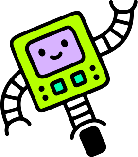

---
# You can also start simply with 'default'
theme: seriph
# random image from a curated Unsplash collection by Anthony
# like them? see https://unsplash.com/collections/94734566/slidev
background: https://cover.sli.dev
# some information about your slides (markdown enabled)
title: Basics of Robotics
info: |
  ## Basics of Robotics: Kinematics and Dynamics
  Presentation slides for the course in USTC Summer School.

  Learn more at [Sli.dev](https://sli.dev)
# apply unocss classes to the current slide
class: text-center
# https://sli.dev/features/drawing
drawings:
  persist: false
# slide transition: https://sli.dev/guide/animations.html#slide-transitions
transition: slide-left
# enable MDC Syntax: https://sli.dev/features/mdc
mdc: true
# open graph
# seoMeta:
#  ogImage: https://cover.sli.dev
---
# Basics of Robotics:   Kinematics and Dynamics <!--Slide 1-->

  Presenter: Yumeng Liu

  <a href="https://lym29.github.io/" target="_blank" class="slidev-icon-btn">
    <carbon:home />
  </a>
  <a href="https://github.com/slidevjs/slidev" target="_blank" class="slidev-icon-btn">
    <carbon:logo-github />
  </a>

<!--
The last comment block of each slide will be treated as slide notes. It will be visible and editable in Presenter Mode along with the slide. [Read more in the docs](https://sli.dev/guide/syntax.html#notes)
-->

---
transition: fade-out
---
# Course Overview <!--Slide 2-->
This course covers the fundamental concepts of robotics, focusing on three key areas:

  

    
🦾

    <h3 class="text-lg font-bold text-white mb-2"> Kinematics Modeling</h3>
    
Forward & Inverse Kinematics

  

  
  

    
🛤️

    <h3 class="text-lg font-bold text-white mb-2">Trajectory Planning</h3>
    
Joint & Operational Space

  

  
  

    
🎮

    <h3 class="text-lg font-bold text-white mb-2">Dynamics & Control</h3>
    
Motion Control & Stability

  

  

    
📚

    

      
Prerequisites

      
Linear Algebra and Calculus

    

  

---
transition: slide-up
---

# Kinematics Modeling <!--Slide 3-->

How do we

[represent robots to describe their structure and motion?]{style="color:red"} :inline-component{prop="value"}

  

    

      
    

    
Robot Arm

  

  
  

    

      
    

    
Quadruped Robot

  

  
  

    

      
    

    
Humanoid Robot

  

---
transition: slide-up
imageMask: 0
---

# Kinematic Chain <!--Slide 4-->
An assembly of rigid bodies (called **links**) connected by **joints**.

  

    
  

  

    
  

  

    
  

  

    <h3 class="text-base font-bold text-blue-800 text-center mb-2">Joint Type</h3>
    

      

        

          
        

        
Revolute Joint

      

      

        

          
        

        
Prismatic Joint

      

      

        

          
        

        
Universal Joint

      

      

        

          

            ⋯
            ⋯
          

        

        
And More

      

    

  

<!-- Revolut Joint: 转动关节
Prismatic Joint: 滑动关节
Universal Joint: 万向关节 -->

---
transition: slide-up
layout: two-cols-header
---

# Denavit–Hartenberg Parameters <!--Slide 5-->
The **Denavit–Hartenberg (DH) parameters** are four values assigned to each robotic link, used to define coordinate frames and calculate transformations between them.

::left::

::right::

  

$\alpha$ and $\theta$ take positive when rotation is made counter-clockwise.

---
transition: slide-up
layout: two-cols-header
---
# Two-Link Planar Arm <!--Slide 6-->

Let's consider a simple example where:
- Each joint is revolute.
- The offset distance between two adjacent links is zero.
- There is no twist between the two joints connected by a link.

::left::

  

::right::

  
DH parameters for the two-link planar arm

| **Link** | **$\theta$** | **$a$** | **$\alpha$** | **$d$** |
|----------|----------------|-----------|----------------|-----------|
| 1        | $q_1$          | $a_1$     | 0              | 0         |
| 2        | $q_2$          | $a_2$     | 0              | 0         |

---
transition: slide-up
layout: two-cols-header
---
# Two-Link Planar Arm <!--Slide 7-->
End effector is the component that interact directly with the environment. 

But how to move it?

::left::

  

::right::
End-effector is attached to Frame $F_2$.

Joint Space:  $[q_1,q_2]$ (rotation angles)

Operational Space:  $[x,y]$ (end-effector position in 2D)

 

  

    Joint Space
  

  

    <svg class="w-6 h-6 text-gray-600" fill="none" stroke="currentColor" viewBox="0 0 24 24">
      <path stroke-linecap="round" stroke-linejoin="round" stroke-width="2" d="M13 7l5 5m0 0l-5 5m5-5H6"></path>
    </svg>
    <svg class="w-6 h-6 text-gray-600" fill="none" stroke="currentColor" viewBox="0 0 24 24">
      <path stroke-linecap="round" stroke-linejoin="round" stroke-width="2" d="M11 17l-5-5m0 0l5-5m-5 5h12"></path>
    </svg>
  

  

    Operational Space
  

---
transition: slide-up
layout: two-cols-header
---
# Forward Kinematics <!--Slide 8-->

  

    Joint Angles → End Effector Position
  

::left::

  

::right::

The transformation matrix from Frame $F_{i-1}$ to $F_{i}$:

$$
T_{i-1}^{i} =
\begin{bmatrix}
\cos q_i & -\sin q_i & 0 & a_i \\
\sin q_i & \cos q_i  & 0 & 0 \\
0            & 0             & 1 & 0 \\
0            & 0             & 0 & 1
\end{bmatrix}
$$

The overall transformation from the base frame $F_0$ to the end-effector $F_2$ is:
$$
T_0^2 = T_0^1 \cdot T_1^2
$$

---
transition: slide-up
layout: two-cols-header
---
# Forward Kinematics <!--Slide 9-->

  

    Joint Angles → End Effector Position
  

::left::

  

::right::

$$
T_0^2 =
\begin{bmatrix}
\cos(q_1 + q_2) & -\sin(q_1 + q_2) & 0 & a_1\cos q_1 + a_2\cos(q_1+q_2) \\
\sin(q_1 + q_2) & \cos(q_1 + q_2)  & 0 & a_1\sin q_1 + a_2\sin(q_1+q_2) \\
0               & 0                & 1 & 0 \\
0               & 0                & 0 & 1
\end{bmatrix}
$$

The position of the end-effector $(x, y)$ in the base frame is given by:
$$
\begin{cases}
x = a_1 \cos q_1 + a_2 \cos(q_1 + q_2) \\
y = a_1 \sin q_1 + a_2 \sin(q_1 + q_2)
\end{cases}
$$

---
transition: slide-up
layout: two-cols-header
---

# Inverse Kinematics <!--Slide 10-->

  

    End effector position → Joint angles
  

::left::

  

::right::
**Analytical Solution**

Given target end-effector position in Cartesian coordinates: $(x, y)$, 

we can convert it to polar coordinates: $(r, \phi)$, where $r = \sqrt{x^2 + y^2}$ and $\phi = \arctan(y/x)$

$$
\begin{cases}
x = a_1 \cos q_1 + a_2 \cos(q_1 + q_2) \\
y = a_1 \sin q_1 + a_2 \sin(q_1 + q_2)
\end{cases}
$$

$$\Longrightarrow r^2 = x^2 + y^2 = a_1^2 + a_2^2 + 2 a_1 a_2 \cos q_2$$

---
transition: slide-up
layout: two-cols-header
---

# Inverse Kinematics <!--Slide 11-->

  

    End effector position → Joint angles
  

::left::

  

::right::
**Analytical Solution**

$$
\begin{aligned}
    &\cos q_2 = \frac{r^2 - a_1^2 - a_2^2}{2 a_1 a_2} \\[1em]
    &\sin q_2 = \pm \sqrt{1 - (\cos q_2)^2} \\[1em]
    &\tan(\phi - q_1) = \dfrac{a_2\sin q_2}{a_1+a_2\cos q_2}\\[1em]
    & q_1 = \phi - \arctan(\dfrac{a_2\sin q_2}{a_1+a_2\cos q_2})
\end{aligned} 
$$

There are two values of the angle $q_2$. Why?

---
transition: slide-up
layout: two-cols-header
---

# Inverse Kinematics <!--Slide 12-->

  

    End effector position → Joint angles
  

::left::

  

::right::
**Analytical Solution**

$$
\begin{aligned}
    &\cos q_2 = \frac{r^2 - a_1^2 - a_2^2}{2 a_1 a_2} \\[1em]
    &\sin q_2 = \pm \sqrt{1 - (\cos q_2)^2} \\[1em]
\end{aligned}
$$

- $q_2 > 0$ (counter-clockwise): "Elbow Up" 
- $q_2 < 0$ (clockwise): "Elbow Down" 

Multiple or even infinite solutions may exist for some configurations.

---
transition: slide-up
---
# Inverse Kinematics <!--Slide 13-->

For more complex structure:

- IK equations are generally nonlinear; closed-form solutions may not exist.
- Some targets may have no solutions due to manipulator limitations.

  
Analytical solutions are often unavailable; numerical methods are required.

  
Key Idea 💡

  
Iteratively adjust joint angles to reduce end effector error.

To do this efficiently, we need to know how small changes in $[q_1,q_2]$ affect $[x,y]$.

---
transition: slide-up
---

# Jacobian Matrix <!--Slide 14-->

The Jacobian matrix is defined as the partial derivatives of the end-effector position with respect to the joint variables:
$$
J(\mathbf{q}) =
\begin{bmatrix}
\dfrac{\partial x}{\partial q_1} & \dfrac{\partial x}{\partial q_2} \\[1em]
\dfrac{\partial y}{\partial q_1} & \dfrac{\partial y}{\partial q_2}
\end{bmatrix}
$$

Relating joint velocities to end effector velocities

$$
\begin{bmatrix}
\dot{x} \\
\dot{y}
\end{bmatrix}
=
J(\mathbf{q})
\begin{bmatrix}
\dot{q}_1 \\
\dot{q}_2
\end{bmatrix}
$$

At each step, the error in task space is computed, and the joint variables are adjusted via the Jacobian (usually its pseudoinverse).

$$\mathbf{q}_{k+1} = \mathbf{q}_k + J^{+}(\mathbf{q}_k) \left( \mathbf{x}_{tgt} - \mathbf{x}_{cur} \right)$$

---
transition: slide-up
layout: two-cols
---
# Numerical IK <!--Slide 15-->
Jacobian pseudo-inverse method
$$\mathbf{q}_{k+1} = \mathbf{q}_k + J^{+}(\mathbf{q}_k) \left( \mathbf{x}_{tgt} - \mathbf{x}_{cur} \right)$$

1. **Initialize** joint variables: $\mathbf{q} \gets \mathbf{q}_0$
2. **Repeat** until error is small enough:
    - Compute current position: $\mathbf{x}_{cur} = FK(\mathbf{q})$
    - Compute error: $\Delta \mathbf{x} = \mathbf{x}_{tgt} - \mathbf{x}_{cur}$
    - Compute Jacobian: $J = J(\mathbf{q})$
    - Compute joint update: $\Delta \mathbf{q} = J^{+} \Delta \mathbf{x}$
    - Update joints: $\mathbf{q} \gets \mathbf{q} + \Delta \mathbf{q}$
3. **Return** $\mathbf{q}$

::right::

  
Real-world Considerations

  

    We often need to consider extra constraints like joint limits and avoiding collisions. 
    So, the IK problem becomes a constrained optimization problem.
  

$$
\begin{aligned}
&\min_{\mathbf{q}} \quad \|\mathbf{x}_{tgt} - f(\mathbf{q})\|^2 \\
&\text{subject to:} \quad q_{min} \leq \mathbf{q} \leq q_{max}, \\
&\qquad\quad\;\;\; \text{collision-free constraint}, \\
&\qquad\quad\;\;\; \text{other constraints}
\end{aligned}
$$

  Additional optimization techniques can be applied, like sampling-based methods and evolutionary algorithms.

---
transition: slide-up
---
# Trajectory Planning <!--Slide 16-->

- **IK:** Finds joint positions to reach a single target pose.
- **Trajectory Planning:** Finds a sequence of joint positions to follow a path over time.
- Trajectories can be generated in **joint space** or **operational space**.

  

    
  

  

    
    

      Operational Space
      Joint Space
    

  

---
transition: fade
---
# Trajectory Planning <!--Slide 17-->

  

    
    

      Operational Space
      Joint Space
    

  

 

  <table class="w-full border-collapse">
    <thead>
      <tr class="bg-gradient-to-r from-blue-500 to-purple-500 text-white">
        <th class="p-3 text-left">Space</th>
        <th class="p-3 text-left">Pros</th>
        <th class="p-3 text-left">Cons</th>
      </tr>
    </thead>
    <tbody>
      <tr class="border-b border-gray-200">
        <td class="p-3 font-semibold bg-blue-50">Operational Space</td>
        <td class="p-3">
          <ul class="list-disc list-inside">
            <li>Motion is predictable</li>
            <li>Better handling of obstacles</li>
          </ul>
        </td>
        <td class="p-3">
          <ul class="list-disc list-inside">
            <li>Slower execution</li>
            <li>Less smooth actuator motion</li>
          </ul>
        </td>
      </tr>
      <tr>
        <td class="p-3 font-semibold bg-purple-50">Joint Space</td>
        <td class="p-3">
          <ul class="list-disc list-inside">
            <li>Faster execution</li>
            <li>Smooth actuator motion</li>
          </ul>
        </td>
        <td class="p-3">
          <ul class="list-disc list-inside">
            <li>Unpredictable intermediate points</li>
            <li>Harder collision avoidance</li>
          </ul>
        </td>
      </tr>
    </tbody>
  </table>

---
transition: fade
---
# Types of Trajectory Planning <!--Slide 18-->
Regardless of whether you choose an operational-space or joint-space trajectory, there are various ways to create trajectories that interpolate pose (or joint configurations) over time.
- Trapezoidal Velocity: piecewise trajectories of constant acceleration

  

    

      <h3 class="text-base font-bold text-blue-800 mb-2">Advantages</h3>
      <ul class="list-none text-blue-700 text-md">
        
Simple and efficient to implement.

        
Smooth start and stop.

      </ul>
    

    

      <h3 class="text-base font-bold text-red-800 mb-2">Disadvantages</h3>
      <ul class="list-none text-red-700 text-md">
        
Abrupt changes in acceleration, the control system cannot respond promptly.

        
May cause mechanical shock and instability.

      </ul>
    

  

  

    
  

<!-- 
缺点：
控制系统对快速变化无法及时响应
mechanical shock: 机械冲击 
当机器人关节的加速度突然从0变为一个很大值时，会产生很大的惯性力，这就是机械冲击。
-->

---
transition: fade
---
# Types of Trajectory Planning <!--Slide 19-->
Regardless of whether you choose an operational-space or joint-space trajectory, there are various ways to create trajectories that interpolate pose (or joint configurations) over time.
- Polynomial: interpolate between two waypoints using polynomials of various orders.
- For example, a 5th-order polynomial requires position, velocity, and acceleration at both endpoints.

  

    

      <h3 class="text-sm font-bold text-blue-800 mb-1">Advantages</h3>
      <ul class="list-none text-blue-700 text-md">
        
Continuous acceleration profile

        
Flexible boundary conditions

      </ul>
    

    

      <h3 class="text-sm font-bold text-red-800 mb-1">Disadvantages</h3>
      <ul class="list-none text-red-700 text-md">
        
Higher computational complexity

        
May have unwanted oscillations

        
Harder to enforce constraints

      </ul>
    

  

  

    
  

---
transition: fade
---
# Trajectory Planning <!--Slide 20-->

  
  

    Trapezoidal Velocity
    Polynomial Interpolation
  

---
transition: slide-up
---

# Dynamics & Control <!--Slide 21-->
- The actual movement of a robot is achieved by **joint actuators**, such as motors (driving units) and reducers (transmission units). 
- These actuators implement force control on the robot.

  
  

<!-- 真正让机器人动起来的是关节执行器，包括电机（驱动装置）、减速器（传动装置）等。执行器对机器人施加外力，控制机器人的运动-->

---
transition: slide-up
---

# Robot Dynamics
Given a feasible path or sequence of joint states for the robot to follow, how can the actuators be controlled to track the trajectory?

The foundation of a dynamic system: **Newton's Second Law**
$$F = ma$$

To analyze the robot’s dynamic system, we consider:

- Actuator torques/forces 执行器输出的驱动力/力矩
- Coriolis and centrifugal forces (due to joint velocities) 科氏力和离心力（旋转坐标系下的惯性力）
- Gravitational forces (due to gravity acting on the links) 作用在连杆上的重力

<!-- 
给定一条机器人需要跟随的可行路径或关节状态序列，如何控制执行器以跟踪该轨迹？ 
我们从牛顿定律出发，对机器人进行受力分析

科里奥利力（Crioris Force、科氏力）：是非惯性（旋转）参照系下出现的一种惯性力。当一个物体在旋转参照系中运动时，除了受到真实的力以外，还会感受到一个与其运动方向和旋转轴方向都有关的“虚拟力”，即科里奥利力。它的作用是使物体的运动轨迹发生偏转，

离心力是一种出现在旋转参照系中的“虚拟力”或“惯性力”。当物体随旋转参考系一起旋转时，物体会感受到一个指向远离旋转轴的力，这个力就是离心力。实际上，离心力并不是由其他物体直接施加的真实力，而是由于物体惯性（保持原有运动状态的趋势）在非惯性系中的体现。
-->

---
transition: slide-up
---

# Robot Dynamics
### Robot Dynamic Equation is given as:
$$
\tau = M(q)\ddot{q} + C(q, \dot{q})\dot{q} + G(q)
$$

- $\tau$：关节驱动力矩（joint torques/forces，由执行器输出）
- $q$：关节角度（joint angles）
- $\dot{q}$：关节角速度（joint angular velocities）
- $\ddot{q}$：关节角加速度（joint angular accelerations）
- $M(q)$：惯性矩阵（inertia matrix）
- $C(q, \dot{q})$：科氏力和离心力项（Coriolis and centrifugal terms），描述由关节速度引起的动力学耦合
- $G(q)$：重力项（gravity effects）

---
transition: slide-up
---

# Model-based Feedforward Control

## Robot Dynamic Equation

$$
\tau = M(q)\ddot{q} + C(q, \dot{q})\dot{q} + G(q)
$$

In an ideal world, the desired accelerations, velocities, and states obtained from trajectory planning can be used in the dynamic equations to estimate the required forces to achieve them.

## Challenges in the Real World

- Model inaccuracies
- External disturbances
- Sensor noise

→ Pure model-based prediction is not enough for precise control

<!-- 
在理想情况下，通过轨迹优化得到的目标（加速度、速度、状态），可以利用动力学方程来估算实现这些目标所需的力。

然而，在实际应用中，由于模型不完善、外部扰动和传感器噪声等各种误差的存在，仅靠模型预测往往难以实现精确控制。因此，我们需要引入基于误差反馈的控制方法，例如PID控制。通过实时监测期望状态与实际状态之间的误差，并根据误差动态调整控制力矩，可以有效补偿系统的不确定性和扰动，从而实现对机器人运动的准确控制。 -->

---
transition: fade-out
---
# Feedback Control

- We need to adjust the actuator based on the system’s feedback.

  

### A Classic Solution: PID (Proportional-Integral-Derivative )
PID is often used to keep systems stable and to maintain control objectives such as temperature, pressure, or position.

$$
\tau = K_p e + K_i \int e\,dt + K_d \dot{e}
$$
where $e = q_d - q$

<!-- 
我们需要根据系统的反馈去修正执行器的输出。

比例项（P）：误差越大，输出越大，帮助系统快速逼近目标。就像你开车追前面的车，距离越远踩油门越大，距离近了就收油门。
积分项（I）：消除稳态误差（比如系统总是差一点点到目标）, 把历史累计的误差都加回来
微分项（D）：关注误差变化的速度，误差正在变大还是变小? 误差变小说明快到目标了，需要的力就小。可以抑制超调和振荡，让响应更平稳。 

-->

---
transition: fade-out
---
# General robot manipulator controller
Combine feedforward and feedback controllers.

  

---
transition: fade-out
---
# Conclusion

  

---
transition: fade-out
---
# Coding Homework
- FK and IK
- A simple trajectory planner
- github repo: https://github.com/lym29/USTCSummerSchool-Homework

  

    <SlidevVideo autoplay controls playbackRate="1.5" class="w-full rounded-md shadow-lg">
      <!-- Anything that can go in an HTML video element. -->
      <source src="./images/homework_demo.mp4" type="video/mp4" />
    </SlidevVideo>
  

---
transition: fade-out
---
# Reference

- [Stanford CS223A-Introduction to Robotics](https://see.stanford.edu/course/cs223a)

- [Modeling, Simulation, and Control from MathWorks](https://www.mathworks.com/videos/series/modeling-simulation-and-control.html)

- [Robotics Modelling, Planning and Control](https://link.springer.com/book/10.1007/978-1-84628-642-1)

---
layout: center
class: text-center
---

  Thank You!

